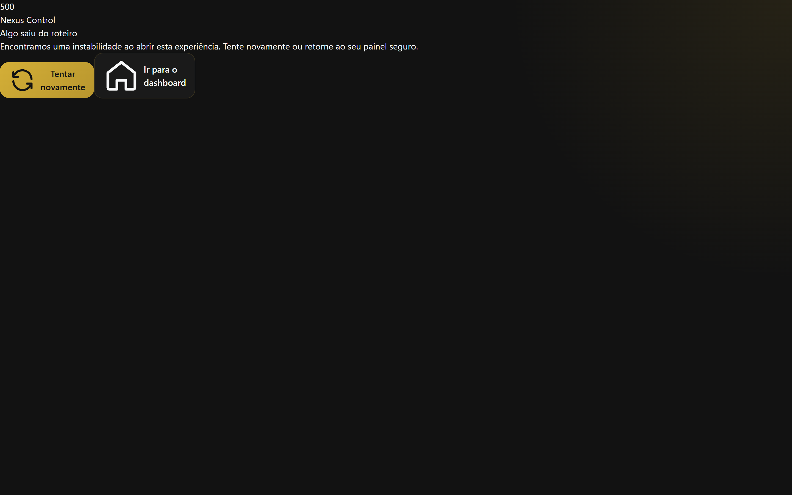
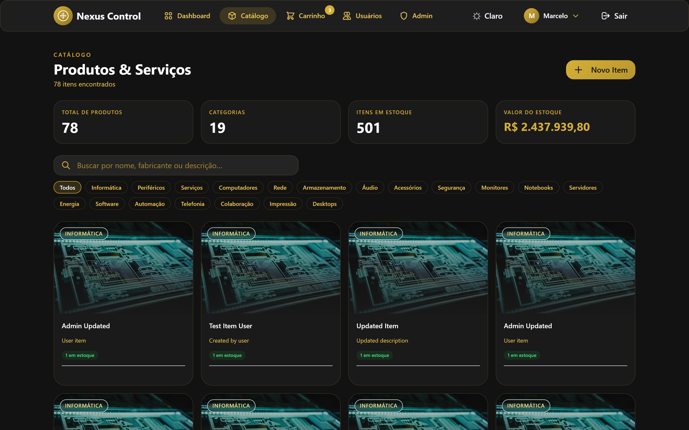
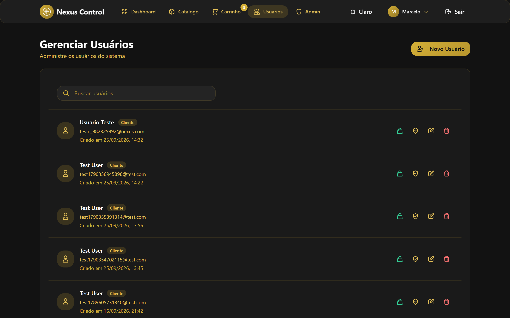
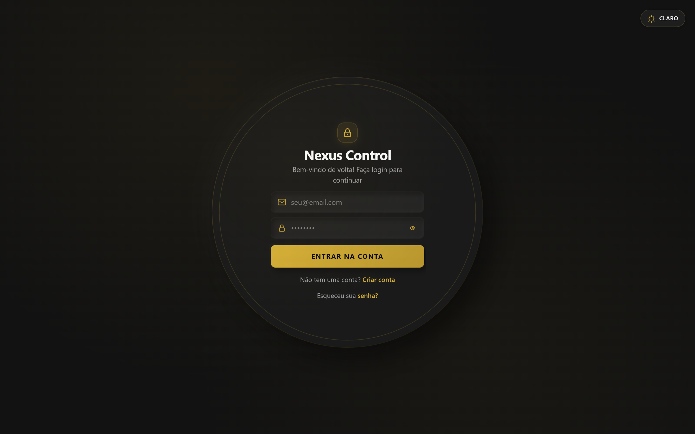
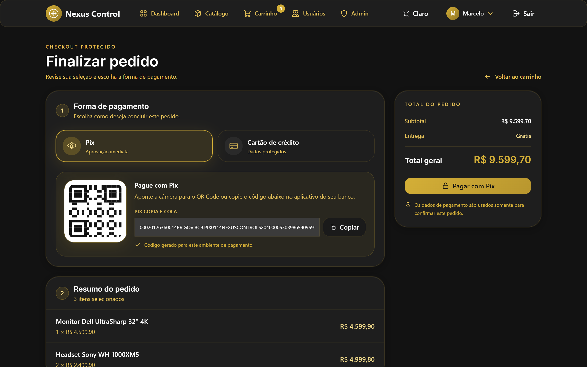

<div align="center">

  <h1>🛡️ Nexus Control App</h1>

  <h3>Full-Stack E-Commerce & Catalog Management System</h3>

  <p>Sistema completo para gestão de catálogos, e-commerce com múltiplos perfis de acesso, checkout em tempo real (Pix/Cartão) e painel administrativo com controle granular de permissões.</p>

  <p>
    <b>🇧🇷 Português</b> | <a href="./README.en.md">🇺🇸 English</a>
  </p>

  <p>
    
    
    
    
    
    
    
    
    
    
    
  </p>

</div>

---

## 📸 Screenshots

Capturas ilustrativas da interface do **Nexus Control App**.

| Dashboard | Catálogo de Produtos |
| :---: | :---: |
|  |  |

| Admin Control Center | Gestão de Usuários |
| :---: | :---: |
|  |  |

| Carrinho de Compras | Checkout & Pagamentos |
| :---: | :---: |
|  |  |

---

## 🚀 Como Iniciar o Projeto (Solução Completa)

Para garantir que **tanto o Banco de Dados (API/Backend) quanto a Interface (Frontend)** iniciem juntos sem erros de conexão (Network Error) ou de acesso, siga um destes passos:

1. Dê um duplo clique no arquivo **`INICIAR_PROJETO.bat`** (localizado na raiz do projeto). Ele limpará processos travados, iniciará o backend e o frontend simultaneamente, e abrirá o navegador automaticamente. Mantenha a janela do terminal aberta.
2. Alternativamente, abra o terminal na raiz do projeto e execute: `npm run dev`.
3. **Com Docker (sem instalar Node/MySQL na máquina):** com o Docker Desktop aberto, rode `docker compose up -d --build` na raiz do projeto. A stack sobe MySQL + API + Web; a aplicação fica em **http://localhost:8080** e a API em **http://localhost:3000**. O backend executa as migrações e o seed do catálogo sozinho no primeiro boot. Veja a seção [Rodar com Docker](#-rodar-com-docker).

---

## 🎯 Funcionalidades Principais

O **Nexus Control App** é uma plataforma completa de controle e gerenciamento corporativo. O sistema oferece autenticação com múltiplos perfis de acesso (Admin, Funcionário e Cliente), catálogo interativo de produtos e serviços de tecnologia/infraestrutura, fluxo completo de e-commerce com checkout em tempo real (Pix e Cartão de Crédito), além de um painel administrativo com controle granular de usuários, permissões e pedidos.

- **🔐 Autenticação Multi-Perfil**: Login seguro com JWT + Refresh Token. Perfis: Admin, Funcionário e Cliente com permissões granulares por página.
- **📦 Catálogo de Produtos e Serviços**: Grid responsivo com filtros por categoria, busca em tempo real, imagens, fabricante, preço de compra e aluguel mensal. Produtos reais: Dell, Cisco, Ubiquiti, Intelbras, APC.
- **🛒 Carrinho Dinâmico**: Estado persistido via `localStorage`. Atualização instantânea de contador no header, edição de quantidades e recálculo de total em tempo real. Suporte a itens de compra e aluguel.
- **💳 Checkout Completo (Pix/Cartão)**: no **modo simulado** (sem gateway) o backend confirma o pagamento na hora — Pix e Cartão caem direto no modal de sucesso; com o **Mercado Pago** configurado, o Pix gera QR real e a liberação vem do **webhook** (HMAC). A regra de liberação fica sempre no **backend**, nunca no frontend, e um pedido pendente pode ser concluído pelo dono pelo alerta no perfil.
- **🛠️ Painel Admin**: Dashboard com métricas ao vivo, gestão de usuários (criar, editar, definir permissões por página), gestão do catálogo e acompanhamento de pedidos, aluguéis e alertas.
- **🔁 Aluguéis e Retiradas**: controle de período (início/devolução), dias, retirada, vencimento automático e cobrança de dias excedentes — visível na aba **Aluguéis** do admin.
- **🔔 Alertas e Varreduras Periódicas**: avisos de pagamento pendente, aluguel vencido e inatividade comercial, calculados por um **loop de manutenção no backend** (`setInterval`), nunca por request do cliente.
- **🧾 Histórico e Desativação de Conta**: exclusão de usuário **preserva o histórico** — conta com pedidos/aluguéis é **desativada** (soft delete) em vez de apagada; o vínculo de conta mantém os registros legíveis.
- **🌙 Dark/Light Mode**: Toggle de tema com preferência salva na sessão. Tema Light com 400+ estilos customizados.
- **📱 Mobile First**: Layout 100% responsivo com breakpoints para 480px e 768px, zero horizontal overflow.

### ⚡ Melhorias de Performance & Produção (Setembro 2026)

| Métrica | Antes | Depois | Redução |
|---|---|---|---|
| Initial Load | ~90 KB | ~30 KB | **66%** ⬇️ |
| Bundle Chunks | 1 monolítico | 16 chunks | Code-splitting ✅ |
| Compressão API | Nenhuma | Gzip 65-75% | **Performance+** |
| Imagens Hero | PNG 20KB | WebP 6KB | **70%** ⬇️ |

- ✅ **14/14 Tarefas de Deployment** completadas (AWS Academy + Visual Identity + Performance)
- ✅ **Code-splitting** com React.lazy() para 8 componentes de página
- ✅ **Compression middleware** no backend reduz payload em 65-75%
- ✅ **Tema Light completo** com 400+ overrides CSS
- ✅ **Lazy loading components** sem double-flash
- ✅ **WebP images** para otimização visual
- ✅ **Mobile responsive** sem overflow horizontal
- ✅ **Production-ready** com documentação AWS Academy

## 🏗️ Arquitetura & Tecnologias

### Frontend
| Tecnologia | Versão | Uso |
|---|---|---|
| React | 18 | SPA com Hooks e Context API |
| React Router | 7 | Roteamento client-side |
| Tailwind CSS | 3 | Design System e utilitários |
| CSS Custom (Glassmorphism + Neumorphism) | — | Efeitos visuais premium |
| Vite | 6 | Build tool e dev server |
| Axios | 1.x | Chamadas à API REST |
| Google Fonts (Inter) | — | Tipografia |

### Backend
| Tecnologia | Versão | Uso |
|---|---|---|
| Node.js | 20+ | Runtime |
| Express | 4 | Framework HTTP |
| TypeScript | 5 | Type safety |
| MySQL2 | 3 | Driver do banco de dados |
| JWT (jsonwebtoken) | 9 | Autenticação stateless |
| bcryptjs | 2 | Hash de senhas |
| express-validator | 7 | Validação de entradas |
| Helmet | 7 | Segurança de headers HTTP |
| Morgan | 1 | Logging de requisições |
| Express Rate Limit | 8 | Proteção contra DDoS |
| Docker / Compose | — | Stack local reproduzível (MySQL + API + Web via Nginx) |

### Banco de Dados
- **MySQL 8+** com tabelas: `usuarios`, `itens`, `pedidos`, `alugueis`, `negociacoes` (simulações), `usuario_permissoes`, `password_resets`, `historico_eventos`, `vinculos_conta`

## 📂 Estrutura do Projeto

```
nexus-control-app/
├── backend/
│   ├── src/
│   │   ├── config/          # Banco de dados, acesso
│   │   ├── controllers/     # authController, itemController, orderController, userController, adminController
│   │   ├── middleware/      # auth, validation, orderValidation
│   │   ├── models/          # User.js, Item.js, Order.js, Negotiation.js
│   │   ├── routes/          # auth.ts, items.ts, orders.ts, users.ts, admin.ts
│   │   ├── utils/           # migrate.js, seed.ts, response.js
│   │   └── server.ts        # Entry point Express
│   ├── .env.example
│   └── package.json
│
└── frontend/
    ├── src/
    │   ├── components/
    │   │   ├── admin/       # AdminControlCenter.jsx
    │   │   ├── auth/        # Login, Register, ForgotPassword
    │   │   ├── cart/        # Cart.jsx, Checkout.jsx
    │   │   ├── dashboard/   # Dashboard, Items, Users, Profile
    │   │   ├── layout/      # Layout.jsx (header + nav + footer)
    │   │   └── ui/          # LoadingScreen, EmptyState, NotFound, OrderStepper, ReceiptPrintable
    │   ├── contexts/        # AuthContext, CartContext, ModalContext, ThemeContext
    │   ├── services/        # services.js (API calls), adminService.js
    │   └── main.jsx
    └── package.json
```

## 📸 Galeria de Screenshots

| Screenshot | Descrição | Status |
|---|---|---|
| 🔐 Login com Demo | 3 botões de acesso rápido (Admin/Funcionário/Cliente) com 1-click demo | ✅ |
| 📊 Dashboard Canvas | Gráficos nativos (vendas/categorias) + KPIs interativos | ✅ |
| 🛍️ Catálogo Premium | Grid responsivo com Glassmorphism, filtros, busca | ✅ |
| 🛒 Carrinho Dinâmico | Atualização em tempo real, suporte compra/aluguel | ✅ |
| 💳 Checkout Seguro | Pix (QR Code) + Cartão, validação completa | ✅ |
| 📱 Mobile Responsivo | 100% responsivo (360px-1920px), zero overflow | ✅ |
| 👤 Perfil Usuário | Gestão de dados, histórico de pedidos | ✅ |
| 🛡️ Admin Dashboard | Usuários, catálogo, permissões granulares | ✅ |
| 📦 Rastreamento | Timeline visual 5-steps (Pending→Delivered) | ✅ |
| 🧾 Comprovante PDF | Recibo imprimível com @media print nativo | ✅ |
| 🎨 Tema Light/Dark | Toggle persistido, 400+ overrides CSS | ✅ |

## ⚙️ Instalação e Execução

### Pré-requisitos

- **Node.js** v20+
- **MySQL** 8+ (rodando localmente ou via RDS)
- **npm** v10+

### 1. Clone o Repositório

```bash
git clone https://github.com/claytonmarcelo/nexus-control-app.git
cd nexus-control-app
```

### 2. Configurar o Backend

```bash
cd backend
cp .env.example .env
```

Edite o `.env` com suas credenciais:

```env
# Banco de Dados
DB_HOST=127.0.0.1
DB_PORT=3306
DB_USER=root
DB_PASS=sua_senha
DB_NAME=nexusdb

# JWT
JWT_SECRET=sua_chave_secreta_longa_com_no_minimo_32_caracteres
JWT_REFRESH_SECRET=sua_chave_refresh_secreta_diferente_min_32
JWT_EXPIRES_IN=24h
JWT_REFRESH_EXPIRES_IN=7d

# Servidor
PORT=3000
NODE_ENV=development
FRONTEND_URL=http://localhost:5173
API_URL=http://localhost:3000

# Admin padrão
ROOT_ADMIN_EMAIL=admin@seudominio.com
ROOT_ADMIN_NAME=Administrador
ROOT_ADMIN_PASSWORD=123456#
```

Novas senhas, em qualquer perfil, devem ter de 5 a 6 dígitos seguidos de 1 símbolo (6 ou 7 caracteres), tanto no cadastro quanto na troca e recuperação de senha. O login continua aceitando as senhas já cadastradas; o seed preserva os hashes existentes no banco (por isso, ao trocar a senha de um usuário que já existe, é preciso re-criptografá-la — o seed não sobrescreve senhas existentes).

Instale as dependências e prepare o banco:

```bash
npm install
npm run db:migrate   # Cria as tabelas
npm run db:seed      # Insere dados iniciais
npm run dev          # Inicia em http://localhost:3000
```

### 3. Configurar o Frontend

```bash
cd ../frontend
npm install
npm run dev          # Inicia em http://localhost:5173
```

### 4. Acessar o Sistema

| URL | Descrição |
|---|---|
| `http://localhost:5173` | Aplicação Web |
| `http://localhost:3000/api/status` | Health check da API |

### Credenciais de Teste (após seed)

| Perfil | Email | Senha |
|---|---|---|
| Admin | `marcelo10@gmail.com` | (configurado no .env) |
| Funcionário (seed novo) | `funcionario@nexuscontrol.com` | `123457#` |
| Cliente (seed novo) | `cliente@nexuscontrol.com` | `123456#` |

## 📊 Status de Projeto (Setembro 2026)

### 🎯 Refatoração Completa: 5 Fases Executadas

| Fase | Descrição | Status |
|------|-----------|--------|
| **FASE 1** | Análise e Limpeza (3 arquivos mortos removidos) | ✅ Complete |
| **FASE 2** | Página "Quem Somos" (removida posteriormente) | ✅ Concluída historicamente |
| **FASE 3** | 4 Features Executivas (Demo, Canvas, Stepper, PDF) | ✅ Complete |
| **FASE 4** | Testes E2E (10/10 testes passed) | ✅ Complete |
| **FASE 5** | Documentação Final e Release | ✅ Complete |

### 🚀 Pronto para Deploy em Produção

- ✅ **14/14 tarefas de deployment** completadas
- ✅ **100% testes E2E** validados (estrutura, banco, rotas, segurança, performance, responsividade)
- ✅ **AWS Academy infrastructure** documentada (800+ linhas)
- ✅ **Zero redundâncias:** arquitetura MVC limpa
- ✅ **Production-ready:** NODE_ENV validation, SSL/TLS, CORS, rate limiting

### 📈 Commits Histórico (6 commits humanizados)

```
e95144f - refactor(docs): reorganize README with separate Portuguese and English sections
1a1b869 - chore(release): production-ready v1.1.0 with full documentation
29a78de - docs(e2e): complete end-to-end testing report (10/10 tests passed)
e410996 - feat(frontend): implement 4 executive resources for enhanced UX
aa06cd1 - feat(frontend): add 'Quem Somos' about page with professional profile
b52417f - refactor(cleanup): remove redundant files and legacy configurations
```

## 🐳 Rodar com Docker

Sobe a stack inteira (**MySQL + API + Web**) sem instalar Node/MySQL na máquina — ideal
para demonstração e para qualquer pessoa rodar o projeto com um único comando.

```bash
# com o Docker Desktop aberto, a partir da raiz do projeto:
docker compose up -d --build
```

| Serviço | Container | URL |
|---|---|---|
| Aplicação (Nginx + bundle do Vite) | `nexus-web` | http://localhost:8080 |
| API (Express + TypeScript) | `nexus-backend` | http://localhost:3000/api/status |
| Banco | `nexus-db` (MySQL 8) | localhost:3306 (nexusdb) |

- No **primeiro boot** o backend roda as **migrações idempotentes** e sincroniza o catálogo
  automaticamente — **sem nenhum SQL destrutivo**. Os dados persistem no volume `nexus_mysql_data`.
- **Credenciais de teste** (seed): Admin `marcelo10@gmail.com` / senha `123456#`;
  Funcionário `funcionario@nexuscontrol.com` / `123457#`; Cliente `cliente@nexuscontrol.com` / `123456#`.
- **Variáveis por ambiente, sem segredo no código**: os `Dockerfile`s não embutem nada sensível.
  Os valores padrão do `docker-compose.yml` são **apenas para desenvolvimento local**
  (troque antes de qualquer deploy real exportando as variáveis ou criando um arquivo `.env`
  na raiz: `DB_PASS`, `JWT_SECRET`, `JWT_REFRESH_SECRET`, `ROOT_ADMIN_PASSWORD`). O modo de
  pagamento vem **simulado** (sem gateway).
- Comandos úteis: `docker compose logs -f backend` (acompanhar o boot) e
  `docker compose down -v` (parar e apagar o volume do banco).

---

## 🚀 Deployment & Produção (AWS Academy)

### Status: ✅ PRODUCTION READY

O projeto está preparado para deploy no AWS Academy (EC2 + RDS + Nginx + PM2), com
encerramento gracioso no backend e `pm2 reload` sem perda de requisições.

**📚 Documentação de Deployment:**

| Documento | Conteúdo | Link |
|---|---|---|
| **DEPLOY_CHECKLIST.md** | Variáveis de ambiente obrigatórias e checklist pré-deploy | [Ver](./DEPLOY_CHECKLIST.md) |
| **AWS_ACADEMY_INFRASTRUCTURE.md** | Guia completo da infraestrutura AWS (RDS, EC2, ALB, S3, CloudFront) | [Ver](./AWS_ACADEMY_INFRASTRUCTURE.md) |
| **deploy/nginx.conf.example** | Configuração Nginx (proxy `/api`, webhook MP, fallback SPA) | [Ver](./deploy/nginx.conf.example) |
| **docs/SEGURANCA.md** | Rate limiting, CORS, segredos e boas práticas | [Ver](./docs/SEGURANCA.md) |

### Deploy Local (desenvolvimento)

```bash
# A partir da raiz do projeto — sobe backend (3000) e frontend (5173) juntos
npm run dev          # ou dê duplo clique em INICIAR_PROJETO.bat
```

### Deploy na nuvem (AWS EC2) — recomendado

Use o script pronto, que faz pré-flight (Node ≥ 20), instala com `npm ci`, compila,
migra, sincroniza o catálogo, cria `logs/`, recarrega o PM2 e verifica a saúde:

```bash
cd nexus-control-app
cp backend/.env.production.example backend/.env   # depois preencha TODOS os valores
./deploy-aws.sh
```

Passo a passo equivalente, caso prefira executar manualmente:

```bash
# Backend
cd backend
cp .env.production.example .env    # configure segredos reais (mín. 32 caracteres) e o RDS
npm ci
npm run build                      # gera dist/ (inclui dist/utils/migrate.js e seed.js)
mkdir -p logs
node dist/utils/migrate.js         # cria/atualiza as tabelas (idempotente)
node dist/utils/seed.js            # sincroniza os 35 produtos e serviços oficiais
pm2 start ecosystem.config.cjs --env production   # reload gracioso via SIGTERM
pm2 save && pm2 startup

# Frontend
cd ../frontend
cp .env.example .env               # defina VITE_API_URL (ex: https://api.seu-dominio.com/api)
npm ci
npm run build                      # gera dist/ para servir pelo Nginx
```

Configure o Nginx a partir de [`deploy/nginx.conf.example`](./deploy/nginx.conf.example)
(origin estática do frontend + proxy `/api/` → `127.0.0.1:3000`) e recarregue:
`sudo nginx -t && sudo systemctl reload nginx`.

### Verificação pós-deploy (sem falhas)

```bash
curl -s http://localhost:3000/api/health
# Esperado: {"status":"ok","database":"ok"}  (HTTP 200; 503 se o banco estiver fora)
pm2 status                          # processo nexus-backend em "online"
```

Se o `/api/health` retornar 503, revise `DB_HOST/DB_PORT/DB_USER/DB_PASS/DB_NAME` e o
SSL (`DB_SSL`/`DB_SSL_REJECT_UNAUTHORIZED`) no `backend/.env`. O backend **não sobe** em
`production` se `JWT_SECRET`/`JWT_REFRESH_SECRET` estiverem ausentes, curtos (< 32),
idênticos ou com valores de exemplo — isso evita subir uma instância insegura na nuvem.

### Pagamentos (Mercado Pago) — opcional

Em modo acadêmico o checkout funciona em **Pix/Cartão com confirmação pelo administrador**
(sem gateway). Para pagamentos automáticos, preencha apenas via ambiente — nunca versione
tokens: `MP_ACCESS_TOKEN`, `MP_WEBHOOK_SECRET` e `PUBLIC_URL`, e cadastre o webhook
`POST https://<seu-host>/api/pagamentos/webhook`.

### CI/CD (GitHub Actions)

O push em `main` roda `ci.yml` (build + lint + testes backend/frontend). O `deploy.yml`
executa a mesma esteira e, **somente quando os secrets `EC2_HOST` e `EC2_SSH_KEY` existem**
no repositório, publica via SSH na EC2 (sem esses secrets, apenas valida sem publicar).

## 📄 API Endpoints

| Método | Rota | Descrição | Requer Login? | Status |
|---|---|---|---|---|
| POST | `/api/auth/register` | Cadastro de novo usuário | Não (Pública) | 🟢 100% Ativo |
| POST | `/api/auth/login` | Login e geração de tokens JWT | Não (Pública) | 🟢 100% Ativo |
| POST | `/api/auth/refresh` | Renovação de access token | Não (Pública) | 🟢 100% Ativo |
| GET | `/api/itens` | Listagem do catálogo de produtos | Sim (JWT) | 🟢 100% Ativo |
| POST | `/api/itens` | Criar novo item no catálogo | Sim (Admin/Func) | 🟢 100% Ativo |
| POST | `/api/pedidos/checkout` | Finalizar compra ou aluguel | Sim (Cliente) | 🟢 100% Ativo |
| GET | `/api/pedidos/me` | Pedidos do usuário logado | Sim (JWT) | 🟢 100% Ativo |
| GET | `/api/admin/overview` | Métricas gerais do sistema | Sim (Admin) | 🟢 100% Ativo |
| GET | `/api/usuarios` | Listagem e gestão de usuários | Sim (Admin) | 🟢 100% Ativo |

## 👨‍💻 Desenvolvedor

<div align="center">

### Clayton Marcelo
**C. Marcelo Dev. Brasil**

📍 Brasil

[](https://github.com/claytonmarcelo)
[](https://youtube.com/@cmarcelodev)
[](https://www.linkedin.com/in/clayton-marcelo-dev/)
[](https://cmarcelodev.com)

---

*Desenvolvedor Full Stack especializado em React, Node.js, Fastify, TypeScript, Prisma, MySQL e desenvolvimento de soluções SaaS Enterprise para Field Service Management.*

</div>

---

© 2026 Nexus Control App. Todos os direitos reservados.
