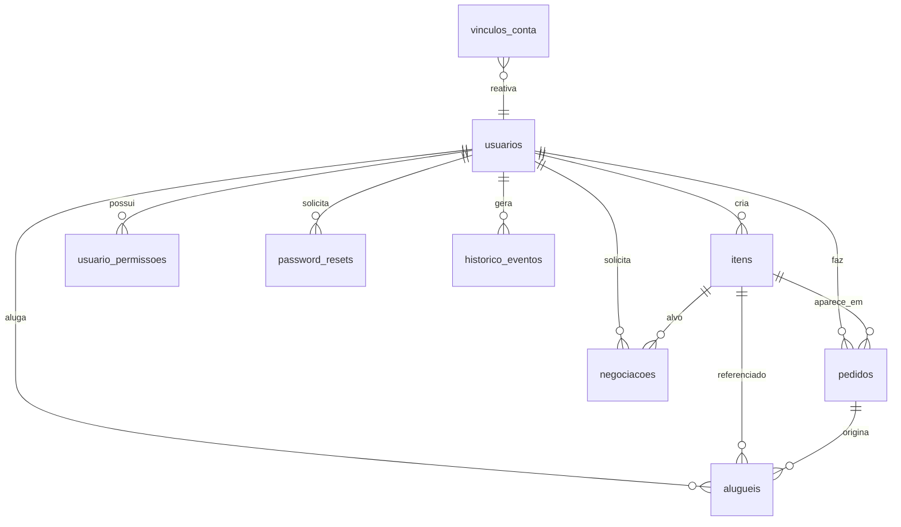
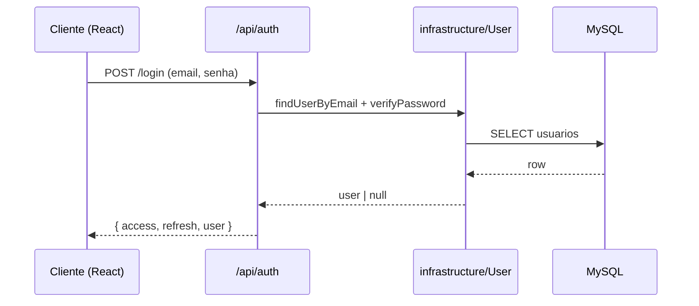
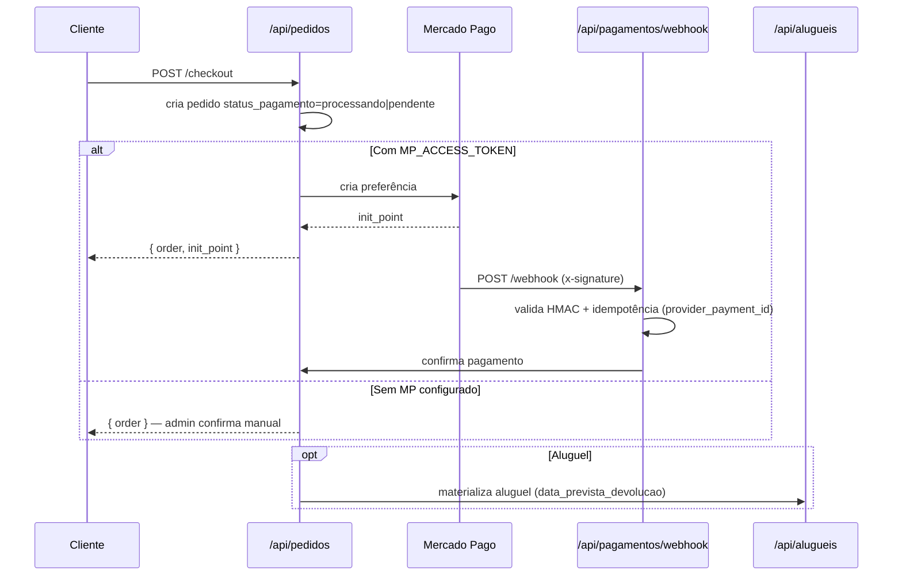
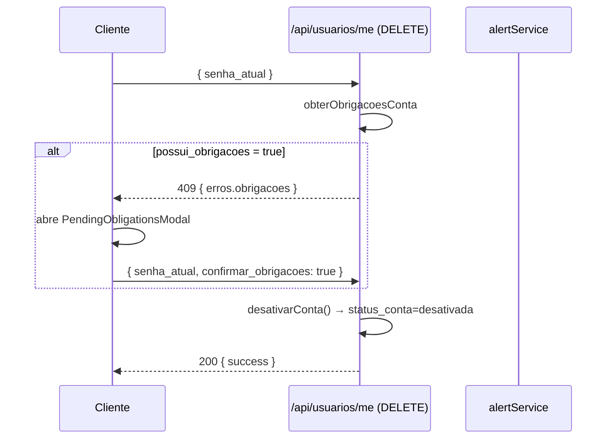

# Arquitetura — Nexus Control App

Aplicação full-stack de catálogo, e-commerce e aluguel de equipamentos, com
controle de acesso por perfis, integrações de pagamento e alertas operacionais.

## Stack

- Backend: Node.js 20+, Express 4, TypeScript 5 (ESM, `moduleResolution: NodeNext`,
  `allowJs: true`). Persistência em MySQL via `mysql2/promise`.
- Frontend: React 18 + Vite 6 + Tailwind CSS 3 + React Router 7; HTTP com
  `axios`; testes com Vitest e Testing Library.
- Banco: `nexusdb` (MySQL 8, `utf8mb4_unicode_ci`), migrations idempotentes
  aplicadas via `backend/src/utils/migrate.js`.
- Autenticação: JWT com access + refresh tokens; `bcryptjs` custo 12.
- Observações: rate limiting (`express-rate-limit`), Helmet, Compression,
  Morgan.

## Camadas (backend)

```
backend/src
├── config/              → env, pool MySQL, segredos JWT, ROOT_ADMIN, páginas
├── domain/entities/     → User, Item, Order (contratos puros)
├── domain/repositories/ → UserRepository, ItemRepository, PermissionRepository
├── infrastructure/      → acesso a dados + integrações (User, Item, Order, Aluguel,
│                          Pagamento, Conta, EventLog, Preco, Permission, PasswordReset,
│                          Negotiation, payments/mercadopago, security/*, utils/*)
├── application/use-cases/ → AuthUseCase, ItemUseCase
├── presentation/
│   ├── middleware/      → authenticate, authorize, authorizePage, validation
│   ├── controllers/     → auth, user, item, order, admin, alert, aluguel, payment
│   └── routes/          → /auth /itens /usuarios /pedidos /admin /pagamentos /alugueis
├── utils/               → response, jwt, migrate, seed, email, passwordPolicy
└── tests/               → api, integration, security, businessRules (Jest)
```

Fluxo de uma requisição:

```
Client → Express → RateLimiter → Helmet → Compression → Route → Middleware (auth, validate)
       → Controller → Service/Infrastructure → MySQL pool → Response (sendSuccess/sendError)
```

## Camadas (frontend)

```
frontend/src
├── main.jsx, App.jsx    → bootstrap, rotas React Router, Suspense/lazy
├── contexts/            → AuthContext, CartContext, ModalContext, ThemeContext
├── services/            → api.js (axios), services.js (agregadores por domínio),
│                          adminService.js
├── components/
│   ├── auth/            → Login (LoginForm + RegisterForm), ForgotPassword
│   ├── dashboard/       → Dashboard, Items, ItemFormModal, RecentItems,
│   │                      OrdersSummaryWidget, Users, UserFormModal,
│   │                      PermissionFormModal, UserHistoryModal, DashboardCanvas, Profile
│   ├── admin/           → AdminControlCenter
│   ├── cart/            → Cart, Checkout, ReceiptPrintable
│   ├── layout/          → Layout (shell com sidebar)
│   ├── ui/              → Spinner, StatCard, EmptyState, NexusLogo, ThemeToggle,
│   │                      OrderStepper, ErrorBoundary, LoadingScreen, NotFound
│   └── welcome/         → WelcomePage (landing pública)
├── utils/               → access.js, date.js, password.js
└── tests/setup.js       → inicialização de Vitest + jest-dom
```

## Modelo de dados

O schema completo está em [DADOS.md](./DADOS.md). Resumo:



Tabelas principais: `usuarios`, `itens`, `pedidos`, `negociacoes`,
`alugueis`, `usuario_permissoes`, `password_resets`, `historico_eventos`,
`vinculos_conta`.

## Rotas backend → controllers

| Prefixo | Route | Controller |
| :--- | :--- | :--- |
| `/api/auth` | `presentation/routes/auth.ts` | `authController.ts` |
| `/api/itens` | `presentation/routes/items.ts` | `itemController.ts` |
| `/api/usuarios` | `presentation/routes/users.ts` | `userController.ts` + `alertController.ts` |
| `/api/pedidos` | `presentation/routes/orders.ts` | `orderController.ts` |
| `/api/admin` | `presentation/routes/admin.ts` | `adminController.ts` |
| `/api/pagamentos` | `presentation/routes/payments.ts` | `paymentController.ts` |
| `/api/alugueis` | `presentation/routes/alugueis.ts` | `aluguelController.ts` |

## Fluxos principais

### Login / registro / recuperação



Registro aceita `senha_conta_desativada` opcional quando o e-mail já
pertenceu a uma conta desativada — a conta volta a `ativo` e o histórico é
reconectado via `vinculos_conta`.

### Checkout + pagamento + aluguel



### Desativação suave e alerta de pendências



### Painel administrativo

- `AdminControlCenter.jsx` agrega seis abas: **Visão geral**, **Pedidos**,
  **Itens**, **Usuários**, **Acessos**, **Aluguéis**.
- Cada aba consome um endpoint próprio (ver [API.md](./API.md)) e usa
  `ModalContext.confirm()` para ações destrutivas.
- Filtros (status do pedido, situação da conta, status do aluguel, status
  de retirada) são enviados ao backend; nada é derivado no cliente.

## Convenções

- Respostas sempre passam por `utils/response.js`
  (`sendSuccess`/`sendError` com envelope `{ statusCode, success, message,
  data, errors, timestamp }`).
- Imports ESM entre arquivos locais usam a extensão `.js`, mesmo quando o
  arquivo-fonte é `.ts` (padrão NodeNext + `allowJs`).
- Enumeração de papéis vive em `infrastructure/User.ts` (`USER_ROLES`),
  de contas em `infrastructure/Conta.ts` (`STATUS_CONTA`), de pagamentos
  em `infrastructure/Pagamento.ts`, de aluguéis em `infrastructure/Aluguel.ts`.
- Middleware `authorizePage('nome-da-pagina')` garante RBAC por página.
- Toda nova env var é registrada em `backend/.env.example` (sem segredo real).
